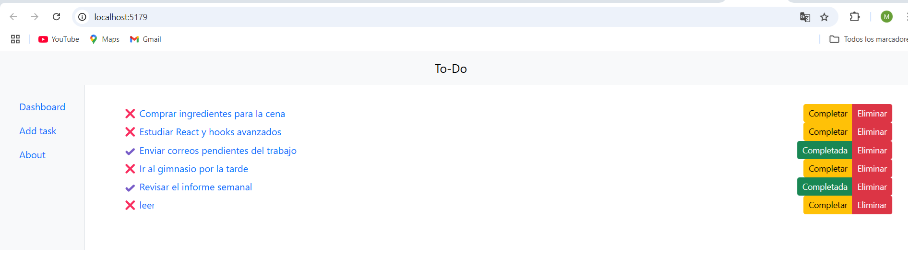

# 1. Introducción

Esta es una aplicación para la gestión de tareas (to-do) creada en el framework React basado en JavaScript. Desde esta aplicación el usuario puede crear, cambiar el estado y eliminar tareas.

# 2. Instalación

Clonar el repositorio:

```bash
git clone https://github.com/Mariluz2024/to-do.git
```

Abrir la carpeta del repositorio recién descargada en Visual Studio Code.

Desde el menú Terminal crear una nueva terminal y ejecutar el siguiente comando:

```bash
npm install
```

# 3. Ejecuión

Para ejecutar el proyecto es necesario escribir el siguiente comando:

```bash
npm run dev
```

# 4. Capturas de pantalla


